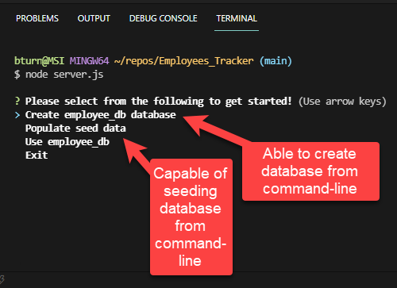
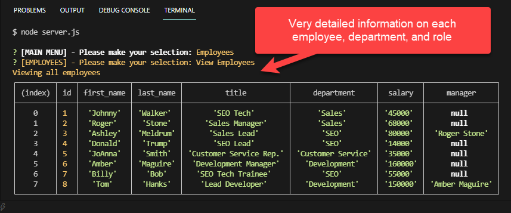
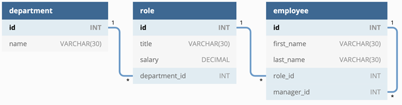

# Professional Employee Tracker 

## Brief Description 📖
   A command line interface to view and manage Company department, employees, and their roles

## Table of Contents 💡
   * [Brief Description](#description)
   * [About Professional Employee Tracker](#about)
   * [Installation](#install)
   * [Usage](#usage)
   * [Testing](#test)
   * [Screenshots](#screenshots)
   * [Demo Video](#demo)
   * [Github Pages Link](#pages) 
   * [Github Repo Link](#repo)
   * [Contact Details](#contact)
   * [License](#license)
   * [Contributions to Repo](#contributions)
   * [Additional Information](#info)

## About Professional Employee Tracker 
   CMS interface using specific technology plugins like Node.js, Inquirer, and MYSQL.  Also capable of creating database, tables/rows, and seeds directly through the same interface and the CMS
   
## Installation 🏗️
   npm i
 
## Usage 📝
   npm start or node server.js   
      
## Testing 
   npm test

## Screenshots 📷
   
    
   
    
   
   
## Demo Video 
   <a href="https://youtu.be/u9HyCvr-b9k" target="_blank">----==== YouTube.com Video Link (with audio) ====----</a>
    
    

   

        
## Github Pages Link 
   <a href="https://bkturner1220.github.io/Employee_Tracker" target="_blank">https://bkturner1220.github.io/Employee_Tracker</a>
   
## Github Repo Link 
   <a href="https://github.com/bkturner1220/Employee_Tracker" target="_blank">https://github.com/bkturner1220/Employee_Tracker</a>
     
## Contact Information 
   Github Username: [bkturner1220](https://github.com/bkturner1220/) 
   Github: <a href="https://github.com/bkturner1220/">https://github.com/bkturner1220/</a> 
   Email: <a href="mailto:bturner@texascdlprep.com">bturner@texascdlprep.com</a>
   
## License Information 
 
   The application is covered under MIT license.
   
## Contributions towards Professional Employee Tracker 🏆
   MYSQL/NodeJS documentation, stackoverflow, and of course SMU Coding Boot Camp
         
## Additional Information 
   If you encounter any problems, please feel free to reach out to me by sending me a [Email] to <a href="mailto:bturner@texascdlprep.com">bturner@texascdlprep.com</a>.
